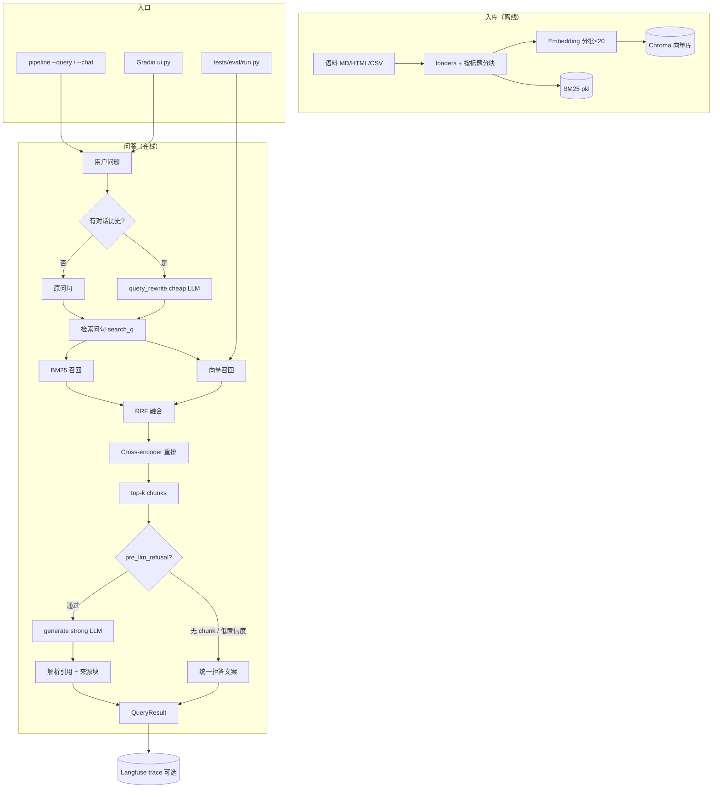

# 系统架构（按当前实现）

> 对应代码：`src/rag_assistant/` · 默认配置：**hybrid + rerank**

## 端到端流程

> 入库阶段详细流程（语料发现、KB 路由、切块、双索引写入）见 [ingest-pipeline.md](./ingest-pipeline.md)。  
> 问答阶段详细流程（含子查询分解、低分过滤、父文档扩展等）见 [query-pipeline.md](./query-pipeline.md)。  
> Chunk 在磁盘上的存储格式与检索时的 dict 结构见 [chunk-data-model.md](./chunk-data-model.md)。



## 模块职责

| 模块 | 职责 |
|------|------|
| `ingest/` | 加载语料、按标题分块 |
| `retrieval/vector.py` | Chroma + embedding |
| `retrieval/bm25.py` | 关键词索引 |
| `retrieval/hybrid.py` | RRF 融合 |
| `retrieval/rerank.py` | bge-reranker 精排 |
| `query_rewrite.py` | 多轮指代补全（有历史才改写） |
| `refusal.py` | 拒答文案 + 低置信度门槛 |
| `generation.py` | Prompt、生成、`Citation` |
| `pipeline.py` | 编排：`ingest` / `query` / `retrieve_chunks` |
| `ui.py` | Gradio 多轮界面 |
| `tests/eval/` | golden 回归 + 三路对照 |

## 观测点（Langfuse）

一次 `query()` 典型 trace：

```
rag-query
├── query-rewrite     （仅多轮）
├── retrieve
└── generate          （在 produce_answer 内）
```

## Eval 基线（2026-07-30）

| 指标 | hybrid + rerank |
|------|-----------------|
| golden pass | 30/30 |
| keyword score | 1.0 |
| recall@4 | 27/27（3 道库外题不计） |

三路对照（vector / hybrid / hybrid+rerank）在本 golden set 上同分，见 `data/eval/results/compare_latest.json`。

## 关键配置（`.env`）

- `RERANK_ENABLED=true` — 默认开重排
- `REFUSE_MIN_RERANK_SCORE=0.15` — 重排 top-1 低于此值直接拒答
- `CHAT_MODEL_STRONG` / `CHAT_MODEL_CHEAP` — 生成 / 改写分级

## 相关文档

- [学习路线图](./learning-roadmap.md)
- [与业界落地差距及后期改造计划](./production-gap.md)
