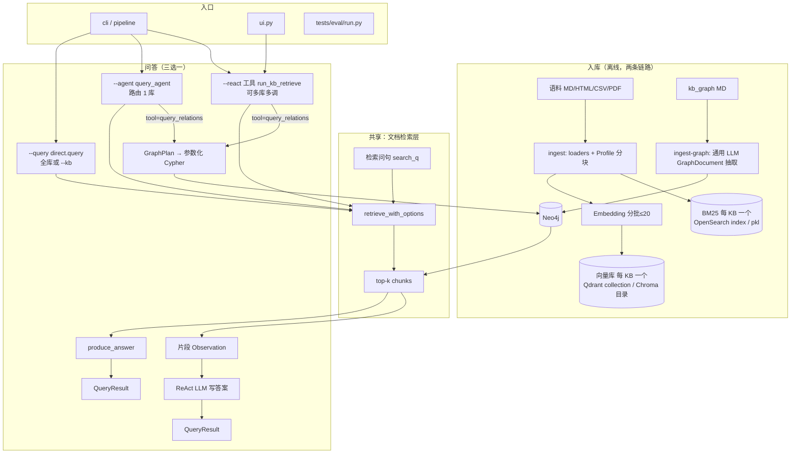

# 系统架构（按当前实现）

> 对应代码：`src/rag_assistant/` · 默认配置：**hybrid + rerank**  
> 入口：`python -m rag_assistant.pipeline` → `cli.main()`（`pipeline.py` 仅为别名）

## 目录结构（问答相关）

```
src/rag_assistant/
├── cli.py                 # argparse：--ingest / --ingest-graph / --query / --agent / --react / --chat
├── pipeline.py            # → cli.main
├── ui.py                  # Gradio（query_agent_react）
├── core/                  # config, logging, llm, paths, observability
├── ingest/run.py          # 文档入库流水线（向量 + BM25）
├── graph/                 # 图入库与图检索（Neo4j）
├── kb/                    # registry, profiles, search（工具 + run_kb_retrieve）
├── retrieval/             # vector, bm25, hybrid, rerank, engine, filters, context
├── answer/                # generate（produce_answer）, refusal
└── query/
    ├── retrieve.py        # retrieve_chunks 入口
    ├── result.py          # QueryResult
    ├── preprocess/        # rewrite, decompose
    └── modes/
        ├── direct.py      # --query（全库 / --kb）
        ├── agent_route/   # --agent（路由选 1 库 + produce_answer）
        └── agent_react/   # --react（ReAct 多工具，工具只返回片段）
```

## 端到端总览

> 入库见 [ingest-pipeline.md](./ingest-pipeline.md)。  
> 问答三条路径见 [query-pipeline.md](./query-pipeline.md)。  
> Chunk 结构见 [chunk-data-model.md](./chunk-data-model.md)。



图链路与文档链路**在工具边界汇合**：`query_relations` 也返回同构的 chunk（`kb=relations`），Agent 侧看不出后端是 Neo4j 还是向量库。

## 三条问答路径

| CLI | 代码入口 | 谁选库 | 谁生成最终答案 |
|-----|----------|--------|----------------|
| `--query` | `query/modes/direct.py` | 用户不选（全库）或 `--kb` | `produce_answer` |
| `--agent` | `query/modes/agent_route/` | cheap LLM function calling 选 **1** 个工具 | `produce_answer` |
| `--react` | `query/modes/agent_react/` | Agent 循环调工具，可 **多个** KB | Agent 读 Observation 后撰写 |

**工具统一约定**（`kb/search.py`）：`build_kb_tools()` 只检索，返回格式化片段；不在工具内调用 `produce_answer`。`run_kb_retrieve` 按 `kb.backend` 分流——`vector` 走 `retrieve_chunks`，`graph` 走 `graph.query.query_relations`。

## 四个知识库工具

| tool | KB | 后端 | 覆盖的问法 |
|------|----|------|-----------|
| `search_policies` | policies | 向量 + BM25 | 制度条文、FAQ、SOP |
| `search_tabular` | tabular | 向量 + BM25 | 工号、分机、邮箱等字段精确匹配 |
| `search_pdf_handbook` | pdf | 向量 + BM25 | PDF 手册、园区后勤 |
| `query_relations` | relations | **Neo4j** | 汇报线、隔级上级、服务依赖链、审批链 |

前三个由 `--ingest` 建索引，第四个由 `--ingest-graph` 建图；`list_vector_kbs()` 保证 `relations` 不会被写进向量库或参与跨库召回。

## 模块职责

| 模块 | 职责 |
|------|------|
| `ingest/` | 语料发现、按 Profile 切块、按 KB 物理分库写向量 + BM25 |
| `graph/models.py` | 通用 `GraphEntity` / `GraphRelation` / `GraphDocument` 抽取模型 |
| `graph/extract_llm.py` | LLMGraphTransformer 风格自动抽取任意实体、关系、属性、别名和证据 |
| `graph/ingest.py` | 动态 Label/关系规范化、开放域实体 ID 对齐、按来源原子增量写 Neo4j |
| `graph/plan.py` | 问句 → 严格 `GraphPlan`；规划失败显式失败，不按旧领域词典猜测 |
| `graph/query.py` | `GraphPlan` → 安全参数化 Cypher → chunk |
| `kb/registry.py` | 四个 KB（policies / tabular / pdf / relations）与 tool 名、后端类型 |
| `kb/profiles.py` | 每库切块 + 检索增强开关（decompose、expand_parent） |
| `kb/search.py` | `run_kb_retrieve`、LangChain 工具、`format_chunks_observation` |
| `retrieval/engine.py` | 子查询分解、召回、rerank、过滤、父文档扩展 |
| `query/preprocess/rewrite.py` | 多轮指代补全（有历史才改写） |
| `query/preprocess/decompose.py` | 可选子查询分解（单库内，默认关） |
| `answer/refusal.py` | 拒答文案 + `pre_llm_refusal` / `is_refusal` |
| `answer/generate.py` | `produce_answer`、`build_citations` |
| `retrieval/rerank.py` | bge-reranker；`RLock` 串行化（ReAct 并行 tool 时防 MPS 崩溃） |
| `cli.py` | 命令行入口 |
| `tests/eval/` | golden 回归、路由 eval、三路检索对照、图 vs 文档对照 |

## 观测点（Langfuse）

**`--query` / `--agent`：**

```
rag-query / rag-agent-query
├── query-rewrite（仅多轮）
├── retrieve 或 agent-route
└── generate（produce_answer 内）
```

**`--react`：**

```
rag-react-query
└── agent-react（工具内检索无单独 produce_answer span）
```

## Eval 基线（2026-08-20，Qdrant + OpenSearch + Neo4j）

| 套件 | 指标 |
|------|------|
| `tests/eval/run.py`（检索 + produce_answer） | golden **33/34**，recall@4 **31/31**（37 题中 3 道图题标 `skip_direct_eval`） |
| `tests/eval/run_routing.py`（`--agent` 选型） | routing **9/9**（含 3 道关系题 → `query_relations`） |
| `tests/eval/run_graph_compare.py`（文档检索 vs 图检索） | 3 道关系题：文档 0/0/1 命中，图 3/3 命中 |
| 单测 | **72** passed（`--ignore=tests/eval`） |

三路检索对照（vector / hybrid / hybrid+rerank）：`tests/eval/compare.py`。

## 关键配置（`.env`）

- `RERANK_ENABLED=true` — 默认开重排
- `RERANK_DEVICE=cpu` — CrossEncoder 默认固定 CPU，避免 macOS MPS native crash
- `REFUSE_MIN_RERANK_SCORE=0.15` — rerank 后低分过滤阈值（滤空 → 拒答）
- `QUERY_DECOMPOSE_ENABLED=false` — 子查询分解（默认关；ReAct 复合题主要靠 Agent 拆 tool query）
- `CHAT_MODEL_STRONG` / `CHAT_MODEL_CHEAP` — 生成 / 改写 / 路由分级
- `GRAPH_LLM_EXTRACT=true` — 通用图入库必需；关闭时显式失败，不回退旧领域规则
- `GRAPH_QUERY_PLANNER=true` — 通用图查询必需；关闭时显式失败，不按词典猜关系
- `NEO4J_URI` / `NEO4J_USER` / `NEO4J_PASSWORD` — 图后端连接

## 相关文档

- [问答流水线](./query-pipeline.md)
- [第 11 周 Graph RAG](./week11-graph-rag.md)
- [与业界落地差距](./production-gap.md)
