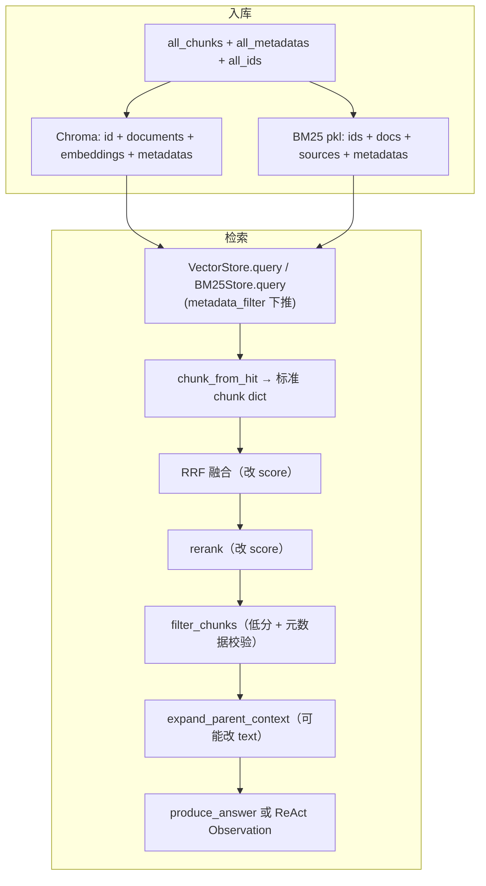

# Chunk 数据模型：存储与检索

> 对应代码：`metadata.build_chunk_metadata()` / `metadata.chunk_from_hit()`  
> 入库写入：`vector.VectorStore.add()` + `bm25.BM25Store.rebuild()`  
> 检索读出：`retrieve_with_options()` → `list[dict]`

入库和问答共用同一批 chunk，但**磁盘上的组织方式**与**检索时在内存里的 dict 结构**不同。本文说明两者及检索各阶段的变化。

## 磁盘上有什么

入库完成后，两个文件/目录：

```
data/chroma/unified/          ← Chroma 向量库（PersistentClient）
data/chroma/unified/bm25.pkl  ← BM25 关键词索引（pickle）
```

同一批 chunk 写两遍：向量路有 embedding，关键词路有倒排索引；**`id` 对齐**，便于 RRF 融合。

---

## 入库：Chroma 一条记录

每个 chunk 在 collection `corpus` 里是一条 upsert 记录：

```python
{
    "id": "c_a1b2c3d4e5f67890",

    "documents": "## 2. 年假\n| 司龄 | 年假天数 |\n...",

    "embeddings": [0.012, -0.034, 0.089, ...],   # 维度取决于 EMBEDDING_MODEL

    "metadatas": {
        "source": "data/corpus/internal/markdown/02-请假与考勤制度.md",
        "kind": "markdown",
        "corpus": "internal",
        "kb": "policies",
        "domain": "hr",
        "parent_text": "## 2. 年假\n| 司龄 | 年假天数 |\n...",
        "chunk_index": 1,
    },
}
```

| 字段 | 含义 |
|------|------|
| `id` | 稳定编号，`ingest/run._chunk_id()` 生成 |
| `documents` | chunk 正文（检索与 embedding 的输入） |
| `embeddings` | 正文向量；**仅 Chroma 有** |
| `metadatas` | 标签字典，见下节 |

写入代码：`retrieval/vector.py` → `VectorStore.add()` → `coll.upsert(...)`。

---

## 入库：BM25 的 `bm25.pkl`

pickle 反序列化后是一个字典，四个平行列表（下标 `i` 指向同一 chunk）：

```python
{
    "ids": ["c_a1b2c3d4e5f67890", "c_xxxxxxxxxxxxxxxx", ...],
    "docs": ["## 2. 年假\n...", "工号=XY003；姓名=周凯；...", ...],
    "sources": [".../02-请假与考勤制度.md", ".../员工通讯录-摘录.csv", ...],
    "metadatas": [
        {"source": "...", "kind": "markdown", "corpus": "internal", "kb": "policies", ...},
        {"source": "...", "kind": "csv", "corpus": "internal", "kb": "tabular", ...},
    ],
}
```

加载时根据 `docs` 分词并构建 `BM25Okapi` 倒排索引（在内存中，不落盘）。**没有 embedding**。

写入代码：`retrieval/bm25.py` → `BM25Store.rebuild()`。

---

## metadata 字段说明

由 `build_chunk_metadata()` 在入库时生成，Chroma 与 BM25 各存一份：

| 字段 | 类型 | 谁写入 | 含义 | 默认问答是否使用 |
|------|------|--------|------|------------------|
| `source` | str | loader 路径 | 来源文件，引用出处 | 是（生成引用） |
| `kind` | str | loader | `markdown` / `html` / `csv` / `pdf` | 否 |
| `corpus` | str | `load_all_documents` | 语料包文件夹名，如 `internal` | 否 |
| `kb` | str | `resolve_kb_id` | 逻辑 KB：`policies` / `tabular` / `pdf` | `--kb` 时 Chroma `where` + BM25 子集召回 |
| `domain` | str | `infer_domain` | 业务领域：`hr` / `it_sec` / `ops` / `tabular` / `general` | **预留，默认未启用** |
| `doc_id` | str | 增量入库 | 文档指纹 ID（`d_` + 路径哈希） | 否（入库跳过/删除用） |
| `file_hash` | str | 增量入库 | 源文件 SHA-256 | 否（未改则跳过 embedding） |
| `parent_text` | str | 切块 | 所属整节原文；子块与整节相同时等于 `text` | 父文档扩展时用 |
| `chunk_index` | int | 切块 | 该文件内第几块（从 0 起） | 否 |

`corpus` 与 `kb` 的区别：

- **corpus**：文件放在哪个语料包文件夹（运维/组织层面）
- **kb**：按数据形态与处理策略分的逻辑库（检索策略层面）

---

## 检索：标准 chunk dict

向量库 `query()` 与 BM25 `query()` 命中后，均经 `chunk_from_hit()` 转为 pipeline 内统一的 dict：

```python
{
    "id": "c_a1b2c3d4e5f67890",
    "text": "## 2. 年假\n| 司龄 | 年假天数 |\n...",
    "source": "data/corpus/internal/markdown/02-请假与考勤制度.md",
    "score": 0.82,
    "kind": "markdown",
    "corpus": "internal",
    "kb": "policies",
    "domain": "hr",
    "parent_text": "## 2. 年假\n...",
    "chunk_index": 1,
}
```

与存储结构的对应关系：

| 存储（Chroma / BM25） | 检索 chunk dict |
|----------------------|-----------------|
| `id` | `id` |
| `documents` / `docs` | `text` |
| `embeddings` | 不返回 |
| `metadatas.*` | 摊平到顶层同名键 |
| — | `score`（检索时才算，入库时没有） |

---

## 检索各阶段：同一 dict，`score` / `text` 会变

以问句「年假有几天？」为例，`retrieve_with_options()` 返回的 list 中每个元素结构相同，但部分字段会随阶段变化。

### 1. 单路召回（向量或 BM25）

指定 `metadata_filter`（如 `--kb policies`）时：

- **向量**：Chroma `collection.query(where={"kb": "policies"}, ...)`
- **BM25**：仅对 `metadatas` 满足条件的文档取 top-k

```python
{"id": "c_...", "text": "## 2. 年假\n...", "score": 0.82, ...}
```

- 向量：`score = 1 - distance`（越大越相似）
- BM25：`score` 为 BM25 原始分（量纲与向量不同）

### 2. 混合检索 RRF 融合

向量 top-N + BM25 top-N 按 `id` 合并后，`score` **替换为 RRF 融合分**（见 `hybrid.rrf_fuse()`）。

### 3. 重排（rerank）

Cross-encoder 对「问题 + chunk 正文」重新打分，`score` **再次替换**为 rerank 相关性分。

### 4. 过滤（filter_chunks）

rerank 低分阈值丢弃；`metadata_filter` 在召回阶段已下推，此处做**二次校验**。

### 5. 父文档扩展（expand_parent_context，可选）

当 `text` 是长节中的子块且 `parent_text` 更长时：

```python
{
    "id": "c_...",
    "text": "## 2. 年假\n...(整节完整内容)...",   # 替换为 parent_text
    "expanded_from_child": True,                 # 新增标记
    "parent_text": "## 2. 年假\n...",
    "score": 0.94,
    ...
}
```

### 6. 交给上层

- **`--query` / `--agent`**：`answer/generate.py` 的 `produce_answer` 用 top-k 的 `text` 拼 prompt；引用用 `source`
- **`--react`**：片段格式化为工具 Observation；最终由 Agent 撰写答案，`build_citations` 合并各次 tool 的 chunks

---

## 存储 vs 检索对照

| | 存储（Chroma / BM25） | 检索（内存 chunk dict） |
|--|----------------------|------------------------|
| 标识 | `id` | `id` |
| 正文 | `documents` / `docs` | `text` |
| 向量 | `embeddings`（仅 Chroma） | 不返回 |
| 来源 | `metadatas.source` | `source` |
| 标签 | 集中在 `metadatas` | 摊平：`kind`、`corpus`、`kb`、`domain`… |
| 分数 | 无 | `score`（含义随阶段变化） |
| 父文档 | `metadatas.parent_text` | `parent_text`；扩展后 `text` 可能变长 |

---

## 数据流



---

## 相关文档

- [入库流水线](./ingest-pipeline.md) — 如何生成并写入上述存储结构
- [问答流水线](./query-pipeline.md) — 检索各阶段如何处理 chunk
- [系统架构](./architecture.md) — 模块职责
