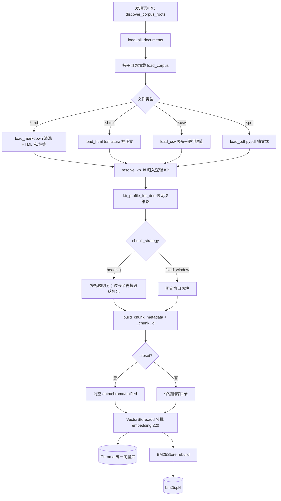

# RAG 入库流水线

> 对应代码：`ingest/run.ingest()` → `load_all_documents()` → `chunk_document()` → `VectorStore.add()` + `BM25Store.rebuild()`  
> CLI：`python -m rag_assistant.pipeline --ingest` → `cli` → `ingest()`  
> 默认命令：`uv run python -m rag_assistant.pipeline --ingest --reset`

## 端到端流程图



## 步骤说明

| 步骤 | 模块 | 说明 |
|------|------|------|
| 1. 发现语料包 | `ingest/run.discover_corpus_roots()` | 扫描 `CORPUS_DIR` 下子目录；含 `markdown/`、`html/`、`csv/` 或 `pdf/` 之一即视为合法包 |
| 2. 加载文档 | `loaders.load_corpus()` | 各类型 loader 产出 `Document(text, source, metadata)`；`corpus` 字段记语料包名 |
| 3. 打标签（KB 路由） | `kb/registry.resolve_kb_id()` | 给文档贴类型标签：`policies` / `tabular` / `pdf`（见下节） |
| 4. 切块 | `chunking.chunk_document()` | 长文切成可检索的小段；策略由标签决定 |
| 5. 贴条（元数据） | `metadata.build_chunk_metadata()` | 每个小段附上来源、类型、标签等，方便检索后过滤和引用 |
| 6. 编号 | `ingest/run._chunk_id()` | 给每段生成唯一 id，向量库和 BM25 用同一编号 |
| 7. 向量入库 | `vector.VectorStore.add()` | 把每段转成向量，写入 Chroma |
| 8. 关键词入库 | `bm25.BM25Store.rebuild()` | 同一批段落再建一份关键词索引（bm25.pkl） |

## 从「KB 路由」开始：通俗版

前面几步很好理解：**找文件夹 → 读文件 → 得到一篇纯文本**。

从第 3 步起，核心问题是：**不同类型的文档，该怎么切、以后该怎么搜？**  
系统没有真的建三个物理数据库，而是在**同一个向量库**里，给每段文字贴一个类型标签（`kb` 字段），并配上对应的处理规则。这个标签 + 规则合称 **KB（知识库）**。

### 第 3 步：打标签（`resolve_kb_id`）

就是一串简单的 if-else，看文件是什么类型：

| 你放的文件 | 贴的标签 `kb` | 含义 |
|-----------|--------------|------|
| `.csv` | `tabular` | **按行存储的表格数据**（一行一条记录）；标签描述数据形态，不假定内容是通讯录 |
| `.pdf` | `pdf` | 无标题结构，需固定窗口切块 |
| 其他（`.md`、`.html`） | `policies` | 有章节结构的制度/FAQ 文档 |

举例：`internal/markdown/请假制度.md` → `policies`；`internal/csv/员工.csv` → `tabular`（内容是通讯录，但标签只表示「表格行数据」）。

> **路由 vs 命名**：当前 demo 把所有 CSV 都路由到 `tabular`，是因为暂时只有这一类表格语料。以后若有多种 CSV（报销明细、设备清单），应扩展 `resolve_kb_id()` 按路径或配置细分，而不是再发明 `contacts` 这类绑定业务含义的名字。

### 第 4 步：切块（`chunk_document`）

一篇文档往往几千字，检索时只能返回几段，所以要**切成小块（chunk）**。

标签决定切法（**KB Profile** = 一切规则的配置卡）：

| 标签 | 怎么切 | 为什么 |
|------|--------|--------|
| `policies` | 按 `# 标题` 切，一节一节来；一节太长再按段落拆 | 制度文档有章节，整节保留上下文更好 |
| `tabular` | 按行切（CSV  loader 已转成「字段=值」逐行文本） | 一行一条记录，适合精确字段匹配 |
| `pdf` | 固定长度窗口（约 800 字一块） | PDF 抽出来的文本往往没有标题 |

切块后每段是一个 **chunk**。若一节被拆成多块，会额外记下整节原文（`parent_text`），问答时可以把「命中的那一小段」扩展回整节（仅 `policies` 默认开启）。

### 第 5～6 步：贴条 + 编号

每段 chunk 入库前会挂上「身份证」：

```
这段文字是什么 → chunk 正文
从哪个文件来的 → source（如 .../请假制度.md）
属于哪类知识 → kb（policies / tabular / pdf）
是第几块 → chunk_index
所属整节原文 → parent_text（可选，供父文档扩展）
```

`_chunk_id` 根据「文件路径 + 块序号 + 块内容」算出一个稳定编号，保证向量库和 BM25 里**同一段文字是同一个 id**。

### 第 7～8 步：写入两个索引

同一份 chunk 列表写两遍，用途不同：

| 索引 | 存什么 | 问答时干什么 |
|------|--------|-------------|
| **Chroma 向量库** | 每段文字的 embedding（语义向量） | 「年假怎么算」这种意思相近的检索 |
| **BM25（bm25.pkl）** | 每段文字的关键词倒排 | 「XY003」「ITSM」这种精确词匹配 |

`--reset` 会先删掉旧的 `data/chroma/unified`，再全量重建，避免删了语料文件后索引里还留着脏数据。

### 走一遍具体例子

入库 `data/corpus/internal/markdown/请假制度.md`（内容含 `## 年假` 等标题）：

1. 读出纯文本，`corpus=internal`，`kind=markdown`
2. 打标签 → `kb=policies`
3. 按 `## 年假`、`## 事假` 等标题切成 3 块
4. 每块贴元数据 + 生成 id
5. 3 块分别 embedding 写入 Chroma，同时写入 BM25

用户问「年假几天」时，两个索引各搜一轮，融合排序后取 top 段给 LLM——那是 [问答流水线](./query-pipeline.md) 的事，入库到此结束。

## 语料目录约定

```
data/corpus/
├── internal/          # 示例：制度 + 通讯录混放
│   ├── markdown/*.md
│   ├── html/*.html
│   └── csv/*.csv
└── kb_pdf/            # 示例：PDF 手册专用包
    └── pdf/*.pdf
```

- 新增知识：往对应子目录放文件 → 再执行 `--ingest --reset`
- `--only <包名>`：仅加载指定语料包（运维调试）
- 产品语义：全部语料打进**同一个**向量库；问答默认查全库，可用 `--kb` 按逻辑 KB 过滤（Chroma `where` + BM25 子集召回，非召回后丢弃）

## KB 标签与切块策略（对照表）

| 标签 `kb` | 什么文件会打上 | 怎么切 | 单块上限 | 问答时的额外行为 |
|-----------|---------------|--------|----------|------------------|
| `policies` | `.md` / `.html` 等默认 | 按标题切 | 1200 字 | 命中后可扩展回整节 |
| `tabular` | `.csv`（当前路由：凡 CSV 归此类） | 按标题切（行文本通常整块就够） | 1200 字 | 不拆复合问、不扩父文档 |
| `pdf` | `.pdf` 或 `kb_pdf` 目录 | 固定窗口 | 800 字 | 不拆复合问、不扩父文档 |

切块原则（`heading`）：

- 以 Markdown 标题为界，一节（标题 + 正文）尽量保持完整
- 单节超过 `max_chars` 时按空行分段打包；单段仍超长则硬切
- 子块保留 `parent_text`，供检索阶段父文档扩展

## 关键参数

- **语料根目录**：`CORPUS_DIR`（默认 `./data/corpus`）
- **向量库路径**：`data/chroma/unified`（`CHROMA_PATH` 可配，pipeline 固定用 unified）
- **Embedding 模型**：`EMBEDDING_MODEL`（默认 `text-embedding-3-small`）
- **入库批大小**：`batch_size=20`（部分国内网关单批上限）
- **BM25 分词**：拉丁词串 + 单汉字，无需 jieba

## CLI 用法

```bash
# 全量重建（推荐：语料有增删改时）
uv run python -m rag_assistant.pipeline --ingest --reset

# 仅重建某一语料包
uv run python -m rag_assistant.pipeline --ingest --reset --only internal
```

建库与问答分离：入库要对全库做 embedding，贵且慢；`--query` / `--chat` 只嵌问题向量。

## 入库后的存储结构

写入完成后，每个 chunk 在 Chroma 与 `bm25.pkl` 中各存一份（同一 `id`）。字段含义、与检索 dict 的对应关系见 [chunk-data-model.md](./chunk-data-model.md)。

## 相关文档

- [Chunk 数据模型](./chunk-data-model.md) — 存储结构 vs 检索返回结构
- [系统架构](./architecture.md) — 模块职责与观测点
- [问答流水线](./query-pipeline.md) — 检索 → 生成
- [关键方案说明](./design-choices.md) — 统一库、分库预演等设计取舍
