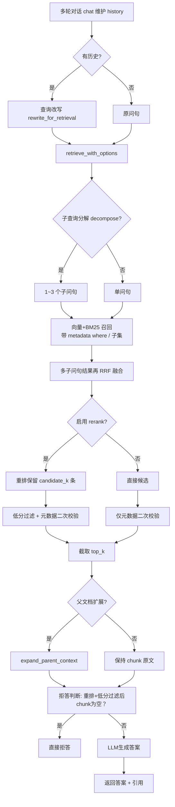

# RAG 问答流水线

> 对应代码：`pipeline.query()` → `retrieve_with_options()` → `produce_answer()`  
> 默认配置：**hybrid + rerank**

## 端到端流程图

## 步骤说明

| 步骤 | 模块 | 说明 |
|------|------|------|
| 1. 多轮对话 | `pipeline.chat()` | 维护 `history`，供查询改写使用 |
| 2. 查询改写 | `query_rewrite.py` | 仅在有历史时触发；补全指代/省略 |
| 3. 子查询分解 | `query_decompose.py` | 可选（`QUERY_DECOMPOSE_ENABLED`）；复合问句拆成 1～3 个子问句 |
| 4. 多路检索融合 | `hybrid.py` | 向量（Chroma `where`）+ BM25（子集打分）各取 `candidate_k`，RRF 融合 |
| 5. 重排 | `rerank.py` | Cross-encoder 精排，保留 `candidate_k` 条 |
| 6. 低分过滤 | `filters.py` | rerank 路径：`REFUSE_MIN_RERANK_SCORE`；`metadata_filter` 二次校验 |
| 7. 截取 top_k | `engine.py` | `candidates[:k]` |
| 8. 父文档扩展 | `context.py` | 可选（`PARENT_EXPAND_ENABLED` / KB Profile） |
| 9. 拒答判断 | `refusal.py` | 生成前：空结果 / 未 rerank 低分；生成后：输出含「无法确认」 |
| 10. LLM 生成 | `generation.py` | strong 模型，带 `[1][2]…` 引用 |

## 关键参数

- **candidate_k** = `max(k * 3, 12)`（启用 rerank 时）；否则为 `k`
- **默认 k** = 4（`--k` 可改）
- **RRF 融合**：hybrid 内部（向量 + BM25）与子查询间各一层，均用 `rrf_fuse()`
- **`--kb` / metadata_filter**：在 Chroma `where` 与 BM25 子集召回阶段下推，避免大库挤占 top-k 后再过滤

## 可选开关

| 开关 | 默认值 | 作用 |
|------|--------|------|
| `RERANK_ENABLED` | `true` | 重排 + 检索阶段低分过滤 |
| `QUERY_DECOMPOSE_ENABLED` | `false` | 子查询分解 |
| `PARENT_EXPAND_ENABLED` | `false` | 父文档扩展（policies KB Profile 默认开） |

## 检索返回的 chunk 结构

`retrieve_with_options()` 返回 `list[dict]`，经 RRF、重排、过滤、父文档扩展后交给 `generation.py`。各阶段 `score` / `text` 如何变化，以及与 Chroma、BM25 存储的对应关系，见 [chunk-data-model.md](./chunk-data-model.md)。

## 相关文档

- [Chunk 数据模型](./chunk-data-model.md) — 存储结构 vs 检索返回结构
- [入库流水线](./ingest-pipeline.md) — 语料加载、切块、向量库 + BM25
- [系统架构](./architecture.md) — 模块职责与观测点
- [关键方案说明](./design-choices.md) — 设计取舍
