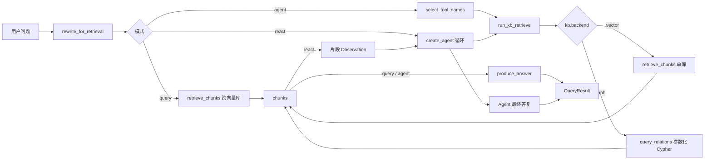
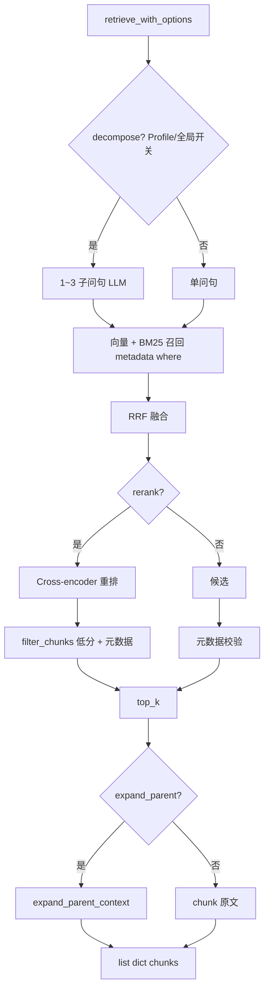

# RAG 问答流水线

> 共享检索：`query/retrieve.py` → `retrieval/engine.retrieve_with_options()`  
> 默认配置：**hybrid + rerank**

问答有 **三条入口**（CLI 标志不同），检索增强在三条路径上 **共用同一套 engine**；差别在 **谁选库、谁写最终答案**。

## 三条路径一览

| 路径 | 入口函数 | 检索 | 生成答案 |
|------|----------|------|----------|
| 直连 | `modes/direct.query()` | `retrieve_chunks(kb_id=…)` 全库或 `--kb` | `produce_answer` |
| Agent 路由 | `modes/agent_route.query_agent()` | 路由后 `run_kb_retrieve`（单库） | `produce_answer` |
| ReAct | `modes/agent_react.query_agent_react()` | 工具内 `run_kb_retrieve`（可多库） | ReAct LLM |

> **`--query` 覆盖不到关系题**：它直连 `retrieve_chunks`，而跨库融合只遍历 `list_vector_kbs()`，图库不在其中。`--agent` 与 `--react` 都经 `run_kb_retrieve`，会按 `kb.backend` 分流到 Neo4j，所以两者都能答关系题——差别只在 `--agent` 选一个工具、`--react` 可以图 + 文档混用。

## 共享检索流水线

以下步骤对 `--query`、`--agent`、ReAct **工具内部**均适用（经 `retrieve_chunks` → `retrieve_with_options`）。`query_relations` 不走这条线，见下方「图检索分支」：

### 步骤与模块

| 步骤 | 模块 | 说明 |
|------|------|------|
| 多轮改写 | `query/preprocess/rewrite.py` | 有 `history` 时 cheap LLM 补全指代 |
| 子查询分解 | `query/preprocess/decompose.py` | `QUERY_DECOMPOSE_ENABLED`；tabular/pdf Profile 强制关 |
| 召回融合 | `retrieval/hybrid.py` 等 | hybrid 或 vector；`kb` 过滤在召回阶段下推 |
| 重排 | `retrieval/rerank.py` | 默认 bge-reranker；并行 tool 时 `RLock` 串行 |
| 低分过滤 | `retrieval/filters.py` | rerank 路径用 `REFUSE_MIN_RERANK_SCORE` |
| 父文档扩展 | `retrieval/context.py` | policies Profile 默认开 |
| 工具层拒答提示 | `kb/search.py` | `pre_llm_refusal` → Observation「未检索到相关片段」 |

### 图检索分支（`query_relations`）

`kb.backend == "graph"` 时 `run_kb_retrieve` 转到 `graph/query.query_relations`，**不做** embedding、BM25、RRF、rerank，因为图查询本身是精确匹配，没有「相似度」可排：

| 步骤 | 模块 | 说明 |
|------|------|------|
| 取目录 | `graph/query._catalog` | 从 Neo4j 读人名/工号、服务名、流程名，作为规划与实体链接的候选集 |
| 出计划 | `graph/plan.plan_graph_query` | cheap LLM 产出 `GraphPlan(pattern, entity, hops, exact_hops, process)`，经 Pydantic 校验；失败降级 `infer_plan_from_lexicon` |
| 实体链接 | `graph/identity.IdentityIndex` | 把「周凯」「XY003」这类写法统一到图里的规范名 |
| 执行 | `graph/query.execute_plan` | 按 pattern 选 Cypher 模板，实体走 `$name` 参数，跳数只来自校验后的 1–3 整数 |
| 转 chunk | `graph/query._chunks` | 把路径拼成自然语言（`周凯 → 何北 → 苏晚`），伪造 `score` 递减，`kb=relations` |

**LLM 不写 Cypher**，只填计划里的几个受限字段；模板是代码里写死的。这样既拿到自然语言理解能力，又不用防注入。

### 关键参数

- **candidate_k** = `max(k * 3, 12)`（启用 rerank 时）
- **默认 k** = 4（`--k`）
- **`--kb`**：仅 `--query`；等价于 metadata `kb=…`

### 可选开关

| 开关 | 默认 | 作用 |
|------|------|------|
| `RERANK_ENABLED` | `true` | 重排 + 低分过滤 |
| `QUERY_DECOMPOSE_ENABLED` | `false` | 单库内子查询分解 |
| `PARENT_EXPAND_ENABLED` | `false` | 全局；policies Profile 仍开 expand_parent |

## 生成与拒答（分路径）

### `--query` / `--agent`：`produce_answer`

| 阶段 | 模块 | 说明 |
|------|------|------|
| 生成前拒答 | `answer/refusal.pre_llm_refusal` | 无 chunk / 未 rerank 低置信度 |
| LLM 生成 | `answer/generate.generate` | strong 模型，`[1][2]…` 引用 |
| 生成后拒答 | `answer/refusal.is_refusal` | 输出含「无法确认」 |
| 引用 | `answer/generate.build_citations` | 拼来源块 |

### `--react`：Agent 写答案

- 工具返回 **片段 Observation**（`format_chunks_observation`），不调用 `produce_answer`
- 最终答复由 ReAct LLM 撰写；`query_agent_react` 用 `is_refusal` 标记拒答
- 引用列表合并各次 tool 的 `chunks` + `build_citations`

## ReAct 与 decompose 的分工

| 能力 | 谁负责 | 适用 |
|------|--------|------|
| **跨库拆题 + 选库** | ReAct Agent（调不同 `search_*` / `query_relations` 工具） | 复合问「报销 + 打印机」、「谁审批 + 审批标准」 |
| **单库内拆句检索** | `decompose_for_retrieval` | `--query` / `--agent` / 工具内检索；默认关 |
| **多跳关系展开** | Cypher 变长路径 `*1..n` | 隔级上级、间接依赖；不靠拆句 |

## 检索 chunk 结构

见 [chunk-data-model.md](./chunk-data-model.md)。

## Eval 说明

- **`tests/eval/run.py`**：固定走 `retrieve_chunks` + `produce_answer`（测检索与生成，**不是** ReAct 端到端）；标了 `skip_direct_eval` 的关系题会跳过，因为这条路径够不到图库
- **`tests/eval/run_routing.py`**：只测 `--agent` 的 `select_tool_names`，含关系题是否选中 `query_relations`
- **`tests/eval/run_graph_compare.py`**：同一道关系题分别跑文档 hybrid 检索与图检索，对比命中，不调生成

## 相关文档

- [系统架构](./architecture.md)
- [入库流水线](./ingest-pipeline.md)
- [第 11 周 Graph RAG](./week11-graph-rag.md)
- [关键方案说明](./design-choices.md)
